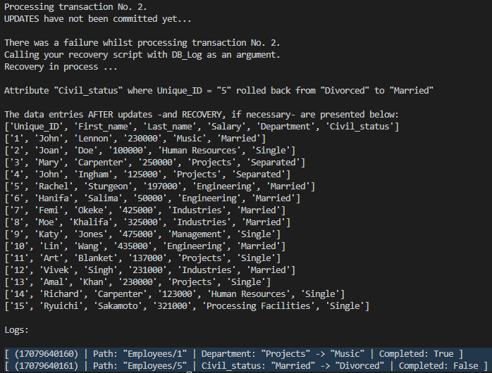

# COMP 4522-002 - Assignment No. 1 - Commit/Rollback

*By Gareth Carvalho*

The Commit and Rollback System can be tested using the command `python main.py` in the root folder of the project.

After every transaction, if there is no failure, the new contents of the database in main memory is written to a file called `new_database.csv` (this is just to ensure the original data is not overwritten for the purpose of the assignment). This is the system 'committing' the data to the 'database'.

The logs are also saved after every transaction to a file named `new_database_Logs.csv`.

If there **is** a failure, then the data is not committed to the file, and the log is updated to reflect that the transaction did not complete. This also reverses the transaction in the main memory.

## Details of the Log System

For the logs, I created a class titled `Log` in the `log.py` file. A `Log` is made of up:

- `transaction_id` (`int | str`) - a unique ID made up of a timestamp and an incrementing number.
- `person_id` (`int | str`) - the `UNIQUE_ID` from the employees table. This represents the 'path'. As there is only one table, the path will always be 'Employees/<`person_id`>'.
- `attribute` (`str`) - the attribute that was changed in the table.
- `before_value` (`int | str`) - the value of the attribute before it was changed.
- `after_value` (`int | str`) - the value of the attribute after it was changed.
- `status` (`bool`) - the status of the transaction. Is `True` if successful, and `False` if not.

The data stucture that I have in main memory to represent the logs is simply a `List` of the `Log` class.

### Rolling Back

When a failure occurs, it happens at a point in time where the data in the main memory has changed and a log has been created, but it has not been committed to secondary memory. To handle the failure, we look at the most recent `Log` in the log list, and reverse the transaction in the main memory using the `attribute`, `before_value`, `after_value` and `person_id` properties of the `Log`.

After the transaction is reversed, the status of the `Log` is set to `False`, as the transaction failed to complete.

This is a sample of what it looks like when a failure occurs:

In the terminal, there were also entries that showed the data before it was changed, but it was too far to scroll. This was present in the starter code and remains unchanged.

That's all there is to my Logging and Rollback system.
